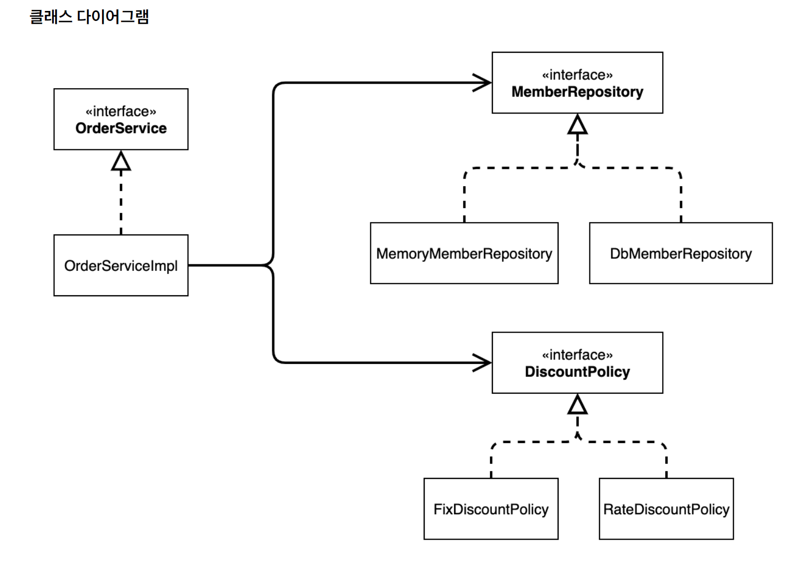
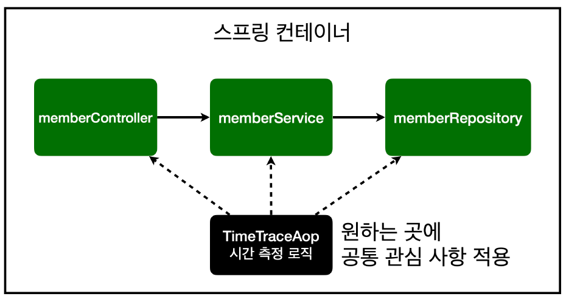
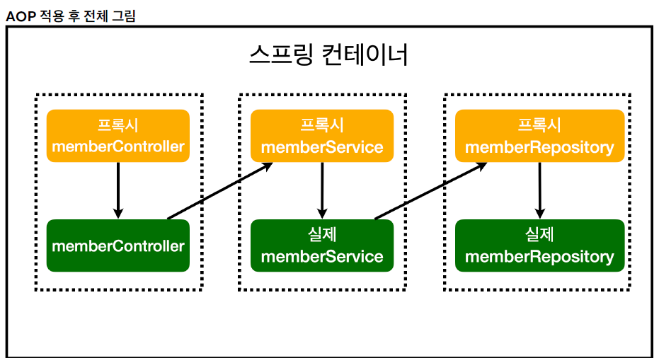

- **SOLID원칙이란?**
    - SRP(single responsibility principle) 단일 책임 원칙

      > 하나의 클래스는 하나의 책임만 가져야 한다.
      >

      하나의 책임? ⇒ 문맥과 상황에 따라 다르다.

      **중요한 기준은 “변경”
      ⇒ 어떤 것을 변경했을 때 파급 효과가 적으면 SRP를 잘 따른 것!**

      ex) UI 변경, 팩토리 메서드 스타일

    - OCP(open/closed principle) 개방-폐쇄 원칙

      > 확장에는 열려 있고 수정에는 닫혀 있어야 한다.
      >

      프로그램의 기능이 변경되거나 확장될 때 기존의 코드를 수정하지 않고도
      새로운 기능을 추가할 수 있어야 한다는 원칙

      **”상속과 다형성을 사용하자”**

      ex) 은행 서비스의 이자 계산 로직이 계좌의 유형마다 다를 수 있다.
      새로운 계좌 유형 추가 시 기존 클래스 수정 ⇒ OCP 위배

      ⇒Account 추상 (인터페이스)를 만들어 계좌 유형에 대한 별도의 클래스
      만들어서 해결

    - LSP(liskov substitution principle) 리스코프 치환 원칙

      > 프로그램의 정확성을 깨뜨리지 않으면서 부모 타입의 객체는 언제나 자식 타입의 객체로 대체될 수 있어야 한다.
      >

      **“자식 클래스는 인터페이스 규약을 다 지켜야 한다는 것”**

      ex) 자동차의 후진 기능은 뒤로 가라는 기능 ⇒ 앞으로 가게 구현하면 LSP위반

    - ISP(interface segregation principle) 인터페이스 분리 원칙

      > 특정 클라이언트를 위한 인터페이스 여러 개가 범용 인터페이스 하나보다 낫다.
      >

      **“인터페이스 분리”**

        - 용도가 명확한 인터페이스를 제공할 수 있어 클래스에 필요한 메서드만 선언
        - 리팩토링을 쉽게 해 재사용성 높임
    - DIP(dependency inversion principle) 의존관계 역전 원칙

      > 클라이언트는 구체 클래스가 아닌 추상 클래스에 의존해야 한다.
      >

      **“구현 클래스에 의존하지 말고, 인터페이스에 의존하자”**

      의존관계 ⇒ 어떤 클래스를 알고 있다는 것 ⇒ 결합도가 높다.

        - 구현체 변경에 용이

- **DI란?**

  Dependency Injection: 의존관계 주입

    - 정적인 클래스 의존관계
        - 클래스가 사용하는 import만 보고도 판단 가능하다.
        - 실제 어떤 객체가 주입될 지 알 수 없다.
        - <출처 - 인프런 ( 스프링 핵심 원리)> - 정적인 클래스 의존관계
        - 

    - 동적인 객체 인스턴스 의존관계
        - 애플리케이션 실행 시점에 실제 생성된 객체 인스턴스의 참조가 연결
        - 애플리케이션 실행 시점에 외부에서 실제 구현 객체를 생성하고 클라이언트에 전달해서
          클라이언트와 서버의 실제 의존관계가 연결 되는 것을 **의존관계 주입**이라 한다.

  ⇒ 의존관계 주입을 사용하면 정적인 클래스 의존관계를 변경하지 않고,
  의존관계를 쉽게 변경할 수 있다.


- **IoC란?**

  **Inversion of Control: 제어의 역전**

  프로그램의 제어 흐름을 직접 제어하는 것이 아니라 외부에서 관리하는 것을 제어의 역전이라고 한다.

    - 프레임워크: 내가 작성한 코드를 제어하고, 대신 실행한다.
    - 라이브러리: 내가 작성한 코드가 제어의 흐름을 담당한다.

  ⇒ 스프링 부트 = 프레임워크

  스프링의 IoC 컨테이너로 ApplicationContext라는
  스프링 컨테이너를 통해 제어한다.

    - 장점
        - 코드 결합도 감소
        - 테스트 용이
        - 핵심 로직에 집중
    - 단점
        - 디버깅 어렵다


- **생성자 주입 vs 수정자, 필드 주입 차이는?**

  스프링에서는 IoC를 실현하기 위한 DI 방법으로 대표적으로 3가지가 있다.

    - 생성자 주입
        - 생성자를 통해서 의존 관계를 주입 받는 방법이다.
        - 생성자 호출 시점에 딱 1번만 호출된다.
        - **불변, 필수 의존관계에 사용
          ⇒ 대부분의 의존관계는 애플리케이션 종료 전까지 변하면 안된다.**
        - 장단점
            - 필드에 final 키워드를 사용하여 값이 설정되지 않는 오류를
              **컴파일 오류로 발견할 수 있다.**
            - 의존관계를 맺는 객체가 많아지면 코드가 방대해질 수 있다.
              ⇒ 롬복 라이브러리 사용

        ```java
        @Component
        public class OrderServiceImpl implements OrderService {
        	private final MemberRepository memberRepository;
        	private final DiscountPolicy discountPolicy;
        	
        	@Autowired
        	public OrderServiceImpl(MemberRepository memberRepository, DiscountPolicy
        	discountPolicy) {
        	this.memberRepository = memberRepository;
        	this.discountPolicy = discountPolicy;
        	}
        }
        ```
      
        ````
        

    - 수정자 주입(Setter 주입)
        - 필드의 값을 변경하는 set메서드를 통해서 의존관계를 주입하는 방법이다.
        - **선택, 변경 가능성이 있는 의존관계에 사용**
        - 장단점
            - 의존관계를 맺어야 하는 객체가 필수인 경우가 아니거나
              런타임 다른 객체로 바꿔야하는 특수한 상황에서 용이하다.
            - **set메서드를 public으로 열어두어야 하는데
              이렇게 되면 누군가 실수로 변경할 수 있다.**

        ```java
        @Component
        public class OrderServiceImpl implements OrderService {
        	private MemberRepository memberRepository;
        	private DiscountPolicy discountPolicy;
        	
        	@Autowired
        	public void setMemberRepository(MemberRepository memberRepository) {
        	this.memberRepository = memberRepository;
        	}
        	
        	@Autowired
        	public void setDiscountPolicy(DiscountPolicy discountPolicy) {
        		this.discountPolicy = discountPolicy;
        	}
        }

        ```
      ````


    - 필드 주입
        - 필드에서 바로 주입하는 방법이다.
        - @Configuration 파일 같은 곳에서만 특별 용도로 사용한다.
        - 장단점
            - 코드가 간결해진다.
            - 외부에서 변경이 불가능해서 테스트하기 힘들다.
            - DI 프레임워크 없으면 불가!
                
                ```java
                @Component
                public class OrderServiceImpl implements OrderService {
                	
                	@Autowired
                	private MemberRepository memberRepository;
                	@Autowired
                	private DiscountPolicy discountPolicy;
                }
                ```
                **
                ```
                
    - 결론
        - 생성자 주입을 기본적으로 사용하되, 필수 객체가 아닌 경우 
        수정자 주입 방식 옵션으로 의존관계를 설정한다.


- **AOP란?**

  AOP: Aspect Oriented Programming

  **특정 서비스에서 공통적으로 필요로 하는 사항이 생긴다. ⇒ 공통 관심 사항**

  이러한 공통 관심사를 모듈화하여 구현하는 프로그래밍

  ex) 서비스 로직이 호출되는 시간을 측정한다.

  시간을 측정하는 로직과 핵심 비즈니스의 로직이 섞인다면? ⇒  유지보수가 어렵다.

  <인프런 - 스프링 입문 (김영한)>


  ⇒ 공통 관심 사항을 모듈화하여 사용한다.


    - 프록시 패턴
        - 프록시: 클라이언트가 서버로 요청하는 직접 호출이 아닌,
          어떤 **대리자를 통해서 간접적으로 서버에 요청**하는 것을 말한다.
            
            - 대체 가능
              ⇒ 즉 클라이언트는 프록시에 요청한 것인지 서버에 요청한 것인지
              몰라야 하기 때문에 둘은 **같은 인터페이스**를 사용해야 한다.
              또한 클라이언트가 사용하는 서버 객체를 프록시 객체로 변경해도
              클라이언트 코드를 변경하지 않고 동작할 수 있어야 한다.
            - 접근 제어
              ⇒ 실제 서버에 접근하는 권한을 체크하여
              접근을 차단하는 역할을 한다.
            - 부가 기능
              ⇒ 원래 서버가 제공하는 기능에 더해서 부가 기능을 수행한다.
              예를 들어 요청 값이나 응답 값을 중간에 변형하거나,
              실행 시간을 측정하여 추가적인 로그 정보를 남길 수 있다.

    - **AOP는 프록시(proxy)패턴을 사용한다!**
        - @Transactional 을 적용하기 위해서 스프링은 프록시 객체를 생성한다.

        ```java
        @Service
        public class MyService {
        
            @Transactional
            public void doSomething() {
                // 비즈니스 로직
                System.out.println("Doing something...");
            }
        }
        ```

        - Subject(주제 인터페이스)
            - 실제 주제와 프록시가 구현해야 하는 공통 인터페이스
        - Real Subject(실제 주제)
            - 실제 작업을 수행하는 객체
        - Proxy(프록시)
            - 실제 주제에 대한 접근을 관리하는 프록시 객체

    - 프록시 패턴 종류
        - **가상 프록시 (Virtual Proxy)**:
            - 실제 객체의 생성을 지연시키기 위해 사용된다
              예를 들어, 무거운 객체를 필요할 때까지 생성하지 않고,
              대신 프록시를 통해 실제 객체에 대한 접근을 지연할 수 있다.

          **원격 프록시 (Remote Proxy)**:

          실제 객체가 다른 주소 공간이나 원격 서버에 있는 경우,
          프록시가 네트워크를 통해 이 객체에 대한 접근을 제공할 수 있다.
          원격 객체에 대한 통신을 캡슐화하여 클라이언트가
          로컬 객체처럼 사용할 수 있게 한다.

          **보호 프록시 (Protection Proxy)**:

          객체에 대한 접근 권한을 제어하기 위해 사용된다.
          프록시는 접근을 관리하며, 클라이언트의 요청이 허용되지 않는 경우
          이를 차단할 수 있다.

          **스마트 프록시 (Smart Proxy)**:

          추가적인 행동을 수행하기 위해 사용된다. 예를 들어, 객체의 참조 횟수를
          계산하거나, 메모리 캐싱, 로깅 등의 부가적인 작업을 수행할 수 있다.

    - 장단점
        - 장점
            - 코드 중복 감소
            - 비즈니스 로직과 공통 관심사의 분리
            - 유지보수성 향상
            - 모듈화를 통한 재사용성
        - 단점
            - 복잡한 AOP는 코드를 복잡하게 한다.
            - 내부 호출 문제


- **서블릿이란?**

  WS: Web Server

  HTTP 기반으로 동작, 정적 리소스 제공

  HTML, CSS, 이미지 등

  WAS: Web Application Server

  HTTP기반으로 동작, 웹 서버 기능 제공

  서블릿 지원, JSP 등

    - 서버에서 처리해야 하는 일
        - HTTP 파싱해서 읽기
        - Content-Type 확인
        - 비즈니스 로직 실행 ,,,,
    - WAS 활용(서블릿 지원)
        - **비즈니스 로직만 실행!**

    - **서블릿 요청, 응답 흐름**
        - HTTP요청 정보 ⇒ HttpServletRequest
            - 요청 시 WAS는 Request, Response 객체를 만들어서 서블릿 객체 호출
        - 개발자는 HTTP 요청 정보를 꺼내서 사용
          or Response 객체 HTTP 응답 정보를 편리하게 입력
        - HTTP응답 정보 ⇒ HttpServletResponse
            - WAS는 Response 객체에 담겨있는 내용으로
              HTTP 응답 생성
        - 개발자는 HTTP 스펙을 매우 편리하게 사용가능하다!

    - **서블릿 컨테이너**
        - Tomcat처럼 서블릿을 지원하는 WAS를
          서블릿 컨테이너라고 한다.
        - 서블릿 객체를 생성, 초기화, 호출, 종료하는 생명주기 관리
        - 싱글톤으로 관리한다.(=하나의 인스턴스를 사용한다.)
            - 최초 로딩 때 만들어두고 재활용

    - 장단점
        - HTTP 요청/응답 처리의 기본 구조를 편리하게 제공한다.
        - 자바 언어와의 강한 결합이 있다.
        - 확장성과 유지보수성이 낮음.