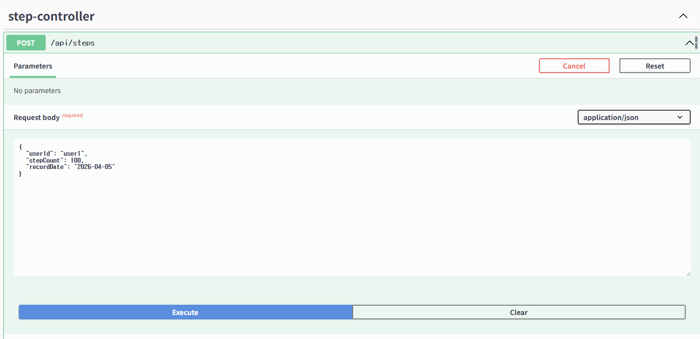

- 아키텍처 구조란?

  **소프트웨어 아키텍처라고 한다.**
  건물을 설계할 때 뼈대와 구조를 잡듯이 개발에서도 시스템의 전체적인 구조와 설계를 말하는 것이다.

  ⇒ 주로 디렉토리 구조로 계층 기반 구조 / 도메인 기반 구조 를 골라서 사용한다.

    - **계층 기반 구조**
        - 패키지 구조만 보고 전체적인 구조를 파악하기 수월하다.
        - 계층별로 모여있다.
        - 디렉토리 내부에 너무 많은 클래스들이 모인다.
    - **도메인 기반 구조**
        - 도메인의 흐름을 파악하기 쉽다.
        - 도메인별로 모여 있어서 관련된 기능 바로 파악.
        - 전반적인 흐름을 한눈에 파악하기 어렵다.
          **개발자 별로 어느 패키지에 넣어야 할 지 애매한 판단이 생길 수 있다.**

  ⇒ SRP / 모듈화 를 원칙으로 설계한다.

    - **필요성**
        - 유지보수가 편리하다.
        - 기능 확장성이 좋다.

    - 아키텍처 설계가 개발에 미치는 영향
        - 조직화
            - ex) 회원 관리, 결제 등 모듈화
        - 통신 방식 결정
            - ex) RestAPI 등 컴포넌트들이 통신하는 방법 덩함
        - 성능 최적화
            - 데이터베이스 연결
        - 확장성
            - ex) 기능 추가 혹은 사용자 수 증가하여도 쉽게 확장하게 함
        - 안정성
            - 장애에 최소한의 영향을 받게 설계

    - 설계 시 해보면 좋은 생각
        - 기능의 확장성
        - 몇 명의 사용자를 대상으로 하는지
        - 데이터는 어떻게 주고 받을지


- Swagger란?

  개발한 API들의 목록을 확인하고 테스트 할 수 있는 프레임워크

  ⇒ 테스트 가능한 API 명세서라고 생각하면 좋다.

    - 주의점
        - 운영환경과 같은 외부에 노츌되면 안되는 곳에서 사용할 땐 주의해야 한다.

    - 자주 사용되는 어노테이션
        - @Operation: API 엔드포인트의 제목 및 설명
        - @Components: 공통적으로 사용할 **Schema**, **Security**, **Parameter** 등을 정의
        - @ApiResponse: 개별 응답 정의
            - **responseCode**: HTTP 상태 코드 ex) "200", "400", "500"
            - **description**: 응답에 대한 설명 ex) "조회 성공", "잘못된 요청"
            - **content**: 응답 데이터의 미디어 타입과 스키마를 정의하는 @Content 설정
        - @Content: API 응답에서 데이터의 형식과 스키마 정의

    - 장단점
        - API문서에서 동적으로 API를 조작할 수 있음
        - 어노테이션을 통해 API문서화 가능
        - API 변경이 발생할 때, 어노테이션 변경 필요
        - 많은 어노테이션은 코드 가독성 떨어지게 함
    - <간단한 동작 예시>


- 도메인형 아키텍처란?

  비즈니스 도메인을 기준으로 파일을 분류하는 디렉토리 구조이다.

    <aside>

  com.example.application
  ├── user (사용자 도메인)
  │   ├── UserController
  │   ├── UserService
  │   ├── UserRepository
  │   └── User
  ├── order (주문 도메인)
  │   ├── OrderController
  │   ├── OrderService
  │   ├── OrderRepository
  │   └── Order
  └── product (상품 도메인)
  ├── ProductController
  ├── ProductService
  ├── ProductRepository
  └── Product

    </aside>

    - 장점
        - 도메인의 응집도가 높다.
            - 도메인의 흐름을 파악하기 쉽다.
              ex) product 흐름이면 product 패키지 하나만 보면 된다.
            - 도메인 관련 변경이 있을 때 변경 범위가 적다.
        - 케이스마다 세분화해서 표현이 가능하다.
    - 단점
        - 애플리케이션의 전반적인 흐름을 한번에 파악하기가 어렵다.
            - 여러 패키지 왔다갔다 해야한다.
        - 개발자의 관점에 따라 애매한 클래스들이 생긴다.
            - ex) welcome 페이지는 어디에 두어야 하나?

    - 전략
        - 프로젝트 규모 및 상황에 따라 비교해서 선택한다.
        - **계층형 구조 선택**
            - 규모가 작고, 도메인이 적은 경우
                - 계층형 패키지 안에 클래스들이 구분이 안될만큼 많아질 경우가 적다.
                - 애플리케이션 흐름 및 가독성이 도메인형보다 좋다.
                - 케이스별로 클래스를 분리하는 경우가 적다.
                - 도메인의 변경이 일어나도, 규모가 작고 도메인이 적은만큼 변경 범위가 그렇게 크지 않을 것이다.
        - **도메인형 구조 선택**
            - 규모가 크고, 도메인이 많은 경우
                - 규모가 크고 도메인이 많은 만큼 도메인의 응집도가 높은 것이 중요할 것이다.
                - 규모가 큰 만큼 케이스별로 클래스를 분리하는 경우가 있을 수 있다.


- DDD vs 도메인형 아키텍처

  DDD: Domain-Driven Design(도메인 주도 설계)

  도메인형 아키텍처: 비즈니스 로직(도메인)을 최우선으로 두고 설계하는 소프트웨어 아키텍처

    - DDD의 특징
        - 데이터 중심의 접근법을 탈피하여 순수한 도메인 모델과 로직에 집중하는 것
        - 도메인 전문가와 개발자의 커뮤니케이션 문제를 줄이고 보편적인 언어를 사용할 수 있다.
        - 도메인 모델부터 코드까지 항상 함께 움직이는 구조를 지향한다.
          ex)  엔티티랑 도메인 컨셉을 일치시키는 방향

      | **구분** | **DDD** | **전통적 개발 방법론** |
              | --- | --- | --- |
      | 핵심 초점 | 도메인 지식과 비즈니스 로직 | 기술적 구현과 아키텍처 |
      | 설계 중심점 | 비즈니스 도메인 이해와 모델링 | 소프트웨어 아키텍처와 기술 요구사항 |
      | 의사소통 방식 | 일상 언어를 통한 통합된 소통 | 기술 중심의 제한적 소통 |
      | 도메인 지식 반영 | 도메인 모델을 통한 직접적 반영 | 제한적이고 간접적인 반영 |
      | 협업 방식 | 도메인 전문가와 개발자의 긴밀한 협력 | 기술팀 중심의 개발 진행 |
        - 장단점
            - 도메인 모델이 비즈니스 개념을 명확히 표현하기 때문에
              비즈니스 전문가와 개발자 간의 소통이 원활
            - 도메인 지식이 코드에 녹아들어
              시스템이 비즈니스 변화에 유연하게 대응할 수 있도록 돕는다.
            - 복잡한 도메인을 모델링하고 코드로 구현하는 과정에서 과도한 설계가
              발생할 위험이 있다.  ⇒ 과도한 세분화가 발생할 수 있다.
            - 도메인 전문가와의 협업과 모델링에 많은 시간을 투자해야 하며,
              이는 초기 개발 속도를 늦출 수 있다. 
            - 
        - Bounded Context
           - 하위 도메인마다 사용하는 용어가 다르기 때문에 올바른 도메인 모델을 개발하려면 하위 도메인마다 모델을 만들어야 한다.
           - 모델은 특정한 컨텍스트(문맥)하에서 완전한 의미를 갖는데, 
           - 이렇게 구분되는 경계를 갖는 컨텍스트를 DDD에서 
        **BOUNDED CONTEXT**라고 한다.
        ex) sales context에서의 상품 / support context에서의 상품의 의미
        
    - 도메인형 아키텍처
        - 도메인 기반 구조로 구현하는 것을 말하고, 상단 항목에 기록해두었다.
        - 코드를 어떻게 배치할 것인가를 다루는 물리적인 뼈대이다.
    
    - 차이점
        - DDD는 문제 도메인을 모델링하는 데 더 중점을 두는 반면 
        도메인형 아키텍처는 유지 관리성, 테스트 용이성 및 적응성을 용이하게 하는 방식으로 
        코드를 구성하는 데 더 중점을 둔다.


- 왜 DTO를 사용하는가?

  Data Transfer Object: 데이터를 전달하는 객체 바구니

  서버와 클라이언트가 데이터를 주고받을 때 사용하는 일정한 형식의 묶음

    - DTO를 사용하는 이유
        - 명확한 데이터 구조 제공
            - 어떤 데이터를 주고받을 지 미리 정해져있다.
        - 불필요한 데이터 보호
            - 필요한 데이터만 담아서 전달
            - 개인정보 같은 민감 정보는 제외하고 전달한다.
        - 데이터 가공 처리
            - 2026-04-06 같은 데이터를 2026년 4월 6일 처럼 변환해서 보낼 수 있다.

    - 예시

        ```java
        public class Order {
            private List<OrderItem> items;
            private User customer;
            
            // Business logic methods...
            
            public double calculateTotal() {
                // Calculate total with discounts
            }
        }
        ```

        ```java
        public class OrderSummaryDTO {
            private long orderId;
            private double totalAmount;
            
            // Getters and setters...
        }
        ```

    - 비즈니스 계층 외에서 로직에 접근 가능해지며 엔티티에 대한 변경이 일어날 수 있다.
        - DTO를 만들어 전달하면 불필요한 비즈니스 로직에 대한 노출을 막을 수 있다.

    - 장단점
        - 장점
            - 비즈니스 로직의 캡슐화
            - 효율적인 데이터 전송
            - 변경에 유연한 설계
            - 보안성 향상
        - 단점
            - 추가적인 유지보수 필요
            - 데이터 동기화 문제
            - 대량의 데이터 변환 시 오버헤드 발생 가능


- 컨버터는 왜 사용하는가?

  Converter: Entity를 Dto로 변환시켜주는 역할

    - 사용이유
        1. **관심사 분리** : Entity 는 데이터베이스 스키마와 밀접하게 연결되어 있고,
           DTO는 클라이언트와의 인터페이스를 담당한다.
           두 계층을 분리함으로써 각 계층의 변경이 다른 계층에 미치는 영향을 최소화 할 수 있다.
        2. **데이터 은닉** : 모든 엔티티 필드가 API를 통해 외부로 노출되는 것은 보안상 큰 문제이다.
           DTO를 사용하고 컨버터를 사용하면 필요한 데이터만 선택적으로 노출할 수 있다.
        3. **유연성** : API 버전 관리나 요구사항 변경 시 데이터베이스 스키마와 독립적으로 API 응답 구조를 조정할 수 있어 유연성이 높아진다.
        4. **성능 최적화** : 필요한 데이터만 주고받음으로써 네트워크 트래픽을 줄이고, 특정 상황에서는 불필요한 데이터베이스 조회를 방지할 수 있다.

  나쁜 예시)

  컨트롤러가 엔티티 변환도 하고 로직도 수행함

    ```java
    @RestControllerpublic class OrderController {     
    		@PostMapping("/orders")    
    		public Order createOrder(@RequestBody OrderDto dto) {       
    			order.setProduct(dto.getProduct());        
    			return orderRepository.save(order);    
    		}}
    ```

  좋은 예시)

    ```java
    @RestControllerpublic class OrderController {     
    	@PostMapping("/orders")    
    	public ResponseEntity<OrderResponseDto> createOrder(@RequestBody OrderRequestDto request) {        
    		return ResponseEntity.ok(orderService.create(request));    
    	}}
    ```
  
