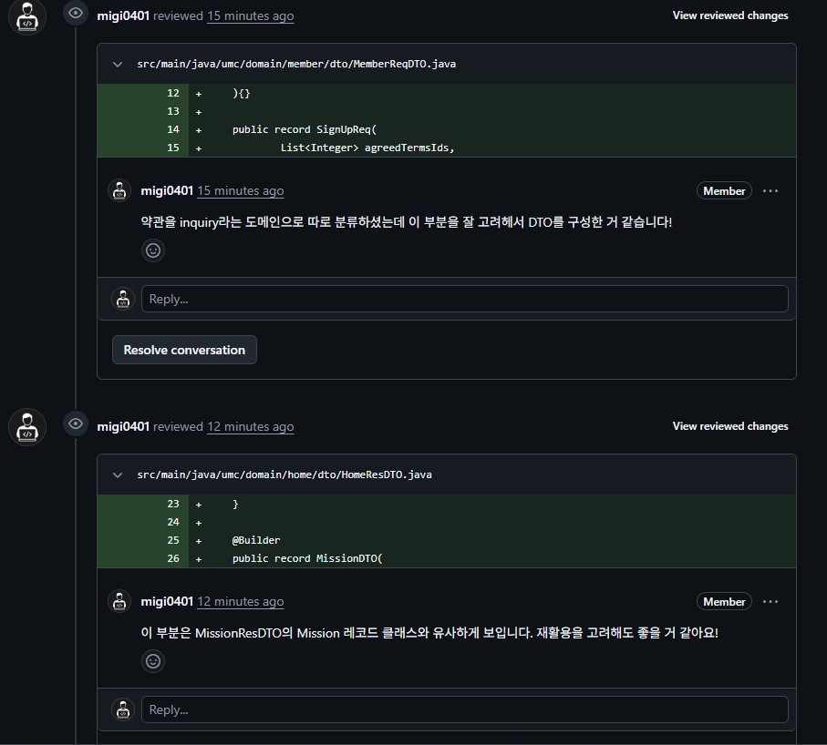
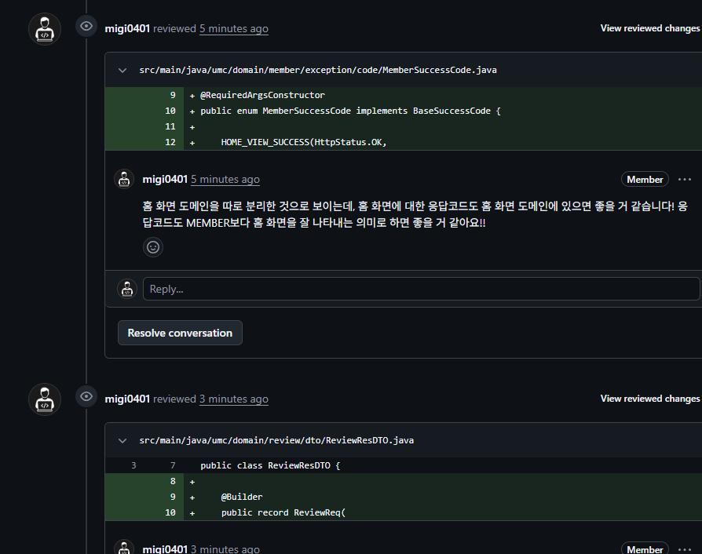
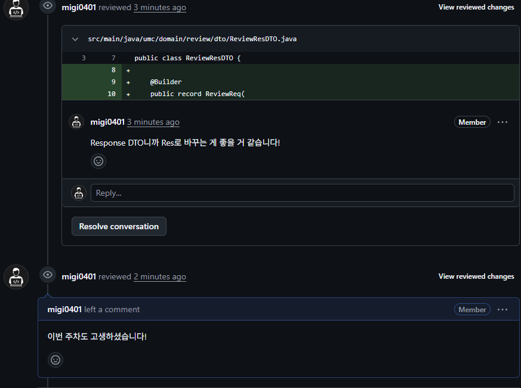
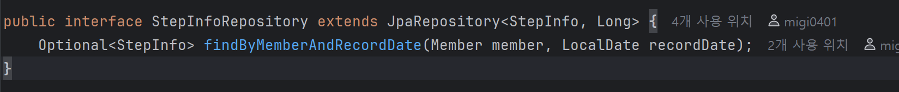

-피어리뷰(스프링A팀 빈)



- 빌더패턴이란?

  **빌더패턴**은 여러 생성자 인수가 필요한 복잡한 개체를 만드는 문제를 해결하는 데 사용되는 생성 디자인 패턴이다.

  **객체의 구성과 표현을 분리**

  **⇒ 생성자에 들어갈 매개변수를
  메서드로 하나씩 받아서 마지막에 통합 빌드해서 객체를 생성한다.**

    - 별도의 Builder클래스를 만들어 메소드를 통해 값을 입력받은 후에 최종적으로 build() 메소드로 하나의 인스턴스를 생성하여
      리턴하는 방식이다.

    - Lombok을 사용하여 구현
        - **Builder패턴을 사용할 클래스**에 어노테이션 작성

            ```java
            import lombok.Builder;
            import lombok.Getter;
            
            @Getter
            @Builder
            public class User {
                private String username;
                private String password;
                private String email;
            }
            ```

        - Builder패턴을 사용하여 객체 생성

            ```java
            public class Main {
            
            	public static void main(String[] args) {
             
            		User user = User.builder()
                    .username("홍길동")
                    .password("password1234")
                    .email("hong@example.com")
                    .build();
            
            	}
            
            }
            ```

    - 장단점
        - 각 메소드 호출이 객체의 어떤 부분을 설정하는지
          명확하게 알 수 있다.
        - 한 번 객체가 생성되면 불변하게 사용할 수 있다.
        - 필요한 매개변수만 선택적으로 설정할 수 있다.

    - 빌더 패턴 네이밍 형식 3가지
        - .username(”홍길동”)
        - .setUsername(”홍길동”)
        - .withUsername(”홍길동”)

- record vs static class
    - record 란 Java 16부터 추가된 특별한 유형의 클래스로, 불변 데이터 클래스이다.
        - 클래스의 내부 선언 없이 private final 필드를 선언할 수 있다.
        - 상속 불가능 처리 (final class)
        - 필드 private final 처리 및 Setter 미구현을 통한 불변성 제공
        - Getter 구현
        - equals(), hashCode(), toString() 구현

        ```java
        public record UserDto(Long userId, String nickname, String email, String profileImg) {}  
        ```

        - 장단점
            - 불변 데이터 클래스임을 명시적으로 드러낼 수 있다.
              ⇒ private final 자동 선언, Setter 제공안함
            - 코드를 간결화
              ⇒ 보일러 플레이트 필드 줄임
            - DTO의 필드가 많을 경우 고려해봐야 한다.

    - static class란 다른 클래스 안에 정의된 클래스를 중첩 클래스라고 하는데, 이때 static을 붙여준 클래스를 말한다.
        - Static이 아닌 멤버 클래스의 객체는 바깥 클래스의 객체와 암묵적으로 연결, 바깥에 있는 객체없이는 생성할 수 없다.
          ⇒클래스에서 바깥 인스턴스에 접근할 일이 없다면 static을 붙여서 정적 멤버 클래스로 선언한다.
        - 장단점
            - 별도의 Dto 클래스 파일을 생성할 필요없이 하나의Dto클래스 안에서 전부 관리할 수 있다.
            - 내부 클래스에서 외부 클래스의 멤버에 쉽게 접근 가능하다.
            - 불변성이 보장되지 않는다.

    - 비교
        - DTO내부의 값을 중간에 세팅해야 하는 경우는 static class
        - 나머지 경우는 불변성 보장을 위해 주로 record를 사용한다.

- 제네릭이란?

  제네릭은 상자에 무엇을 담을지 미리 라벨을 붙여놓는 것이다.

  즉, 클래스 내부에서 사용할 데이터 타입을 외부에서 지정하는 기법을 의미한다.
  자바에서 지원하는 기능으로 안전하다.

  ⇒ 객체 별로 다른 타입의 자료가 지정될 수 있다.

    ```java
    class FruitBox<T>{
    	List<T> fruits = new ArrayList<>();
    	//new 생성자 부분의 타입 매개변수는 생략 가능
    	
    	public void add(T fruit){
    		fruits.add(fruit);
    	}
    }
    ```

  <> 여기 안에 지정해주고 싶은 타입명을 할당한다!

  ⇒ 제네릭에서 할당 받을 수 있는 타입은 Reference 타입 뿐이다. int, double 같은 원시 타입은 불가하다. / wrapper 클래스 사용처럼 Integer, Double 형 이런 클래스 사용한다.

  만약 T가 Integer라면, 내부에서 T타입으로 지정한 멤버들에게 전파된다. 이를 **구체화** 라고 한다.

    - 제네릭 클래스는 클래스나 인터페이스 이름 바로 뒤에
      <Type> 같은 형식의 파라미터를 붙여 선언한다.
        - type들을 쉼표로 구분하면 여러 개를 지정할 수도 있다.
        - 중첩 타입 파라미터도 가능하다. T에 <LinkedList<String>>넣기
    - 제네릭은 엄격하다
      ⇒ List<Number>에 List<Integer>를 넣을 수 없다.
    - 와일드카드를 사용한다.
      ⇒ List<? extends Number> 쓰면 List<Integer>도 받아준다.

    - 장단점
        - 컴파일 타임에 타입 검사를 통해 예외 방지
        - 불필요한 casting 없앤다.
        - 제네릭 타입 자체로 타입 파라미터를 지정할 수 없다.
        - Static멤버에 제네릭 올 수 없음

- @RestControllerAdvice이란?

  @RestController 어노테이션이 붙은 컨트롤러에서 발생하는 예외를 AOP방법을 적용해 예외를 전역적으로 처리할 수 있는 어노테이션이다. @ControllerAdivice와 달리 응답을 JSON으로 내려줄 수 있다.

    - basePackages속성을 이용해서 특정 패키지나 클래스에만 적용할 수 있다.

    ```java
    @RestControllerAdvice(basePackages = "com.example.controller")
    ```

    - @Order 어노테이션을 사용해서 여러 개의 @RestControllerAdvice나 @ControllerAdvice 클래스 중 어떤 것이 먼저 실행될 지 설정할 수 있다.

    ```java
    @Order(1)
    @RestControllerAdvice
    ```

    - 장단점
        - 하나의 클래스로 모든 Controller에 대한 전역적인 예외처리가 가능해서 훨씬 깔끔하게 예외처리를 할 수 있다.
        - 무분별한 try-catch가 없어서 가독성이 좋다.
        - 예외가 전역에서 처리되므로 디버깅할 때 복잡할 수 있다.

- Optional이란?

  Optional은 null인 값을 참조해도 NullPointerException이 발생하지 않도록 값을 래퍼로 감싸주는 타입이다.

  주로 SpringDataJpa 사용할 때 메소드들이 Optional 타입이다!
- 
- 

    ```java
    // Java8 이전
    List<String> names = getNames();
    List<String> tempNames = list != null 
        ? list 
        : new ArrayList<>();
    
    // Java8 이후
    List<String> nameList = Optional.ofNullable(getNames())
        .orElseGet(() -> new ArrayList<>());
    ```

    - 정적 메서드(엄청 많음)
        - of(): 값이 null이 아닌 경우에만 Optional 객체 생성
        - ofNullable(): 값이 null인 경우에도 Optional 객체 생성
        - empty(): 값이 null인 경 빈 Optional 객체 생성

    - orElse, orElseGet ⇒ Optional의 값이 null인 경우 실행
        - orElse: 파라미터로 값을 받는다.
            - 값이 미리 존재하는 경우에 사용
        - orElseGet: 파라미터로 함수를 받는다.
            - 값이 미리 존재하지 않는 거의 모든 경우에 사용

  ⇒ Optional은 결과가 null이 될 수 있으며, null에 의해 오류가 발생할 가능성이 매우 높을 때 반환값으로만 사용해야 한다.

    - 장단점
        - 값을 wrapping 하고 풀고, null일 경우 대체 함수를 호출하는 등의 오버헤드가 발생한다.