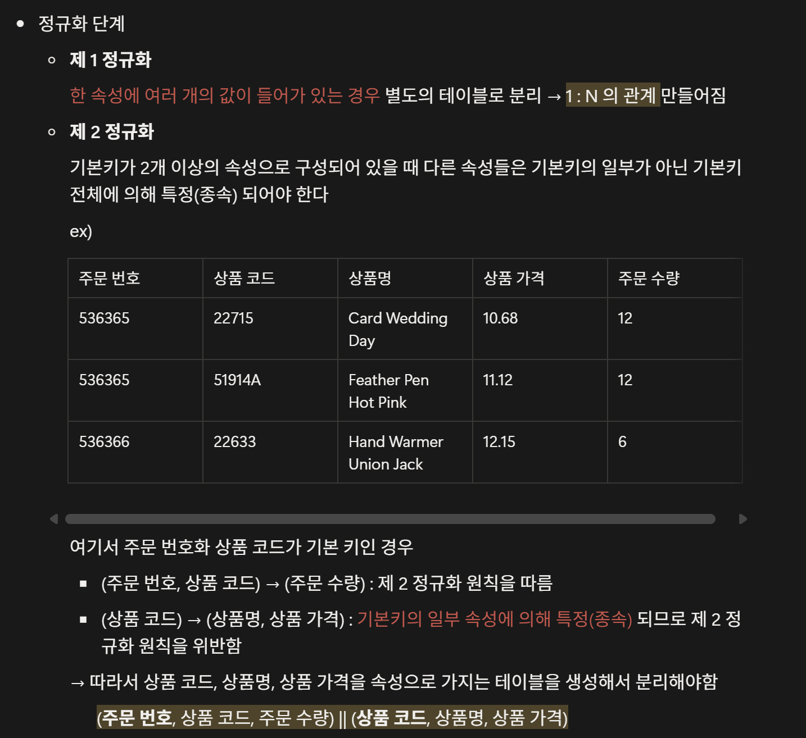
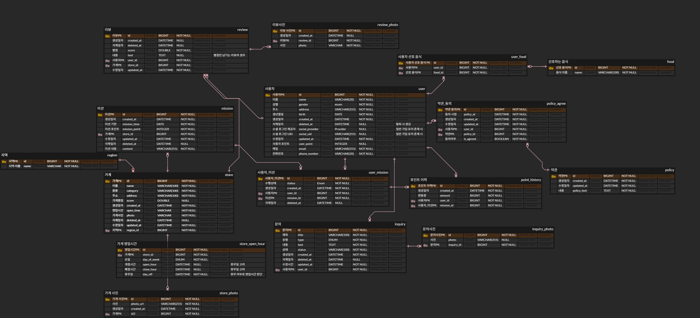
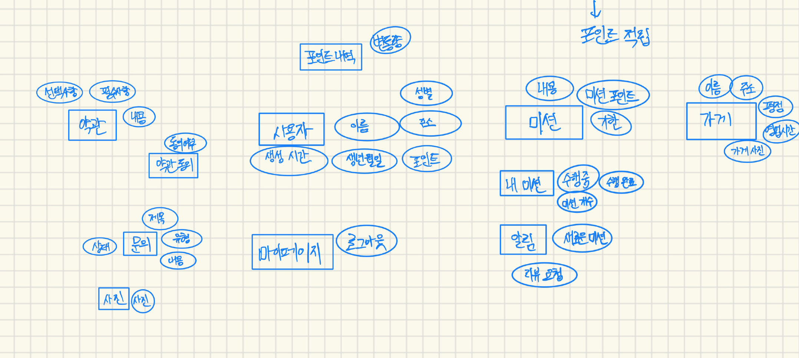

### 워크북 캡쳐

### 워크북 리뷰

<aside>
🌟

<"빈"의 워크북>
정규화 과정이 이론을 텍스트로 보면 정말 헷갈리기 쉬운데, 이렇게 예시를 들어서 표로 제작해서 볼 수 있으니 이해가 쉽습니다. 예시를 설명할 수 있을 정도로 깊은 학습을 하신 부분이 인상적입니다!

</aside>

- **미션 기록**

  ERD 사진

  설명

    <aside>

  먼저 개념적으로 무엇이 필요한지 간단한 모델링을 해보았다. IA만 보고는 요구사항을 알 수 없어서 와이어프레임을 보고 제작했다.

  우선 로그인 구현을 위해 **사용자 정보**가 필요한 부분을 설계했다. 회원가입 폼을 보고 어떤 것들이 필요한 지 알 수 있었다. 소셜 로그인 부분은 워크북에 나와있는 테이블을 보고 ‘소셜 로그인 제공자’ , ‘소셜 로그인 UID’ 를 적어넣었다.

  **약관 동의 페이지**를 구성하기 위해 약관 테이블을 따로 만들었고, 사용자도 여러 명이고 약관도 여러 개로 다대다 관계이기 때문에 중간에 약관_동의 테이블을 두어 일대다 두 개로 연결했다.

  **사용자가 선호하는 음식 종류**도 사용자와 다대다 관계를 맺고 있다. 하나의 음식은 여러 명의 사용자에게 선택되어 질 수 있고, 하나의 사용자는 선호하는 음식을 중복 선택할 수 있다. 따라서 사용자 선호 음식이라는 페이지를 두어 일대다 관계 두 개로 구성했다.

  홈 화면을 구성할 때 내 미션과 미션 상태가 보여진다. 사용자와 미션은 다대다 이므로 **사용자 미션 테이블**을 두어 다대다 관계를 해소하고 사용자 미션 테이블에서 수행상태를 이용하여 수행된 미션의 개수 파악을 통해 데이터를 조회할 수 있다고 생각했다.

  **미션 테이블**은 가게 하나 당 여러 개가 있는 관계이기 때문에 일대다로 구성했다. 생성 일자와 기한을 두어 최신순으로 조회하거나 남은 일자를 볼 수 있게 했다.

  미션 목록을 띄울 때 가게이름과 종류도 같이 들어가기 때문에 외래 키로 가게 PK를 설정했다.

  **리뷰**는 닉네임을 통해 달지만, 회원가입 폼에는 따로 없어서 사용자 정보를 외래 키로 참조하여 진행했다. 생성일자와 평점, 리뷰 사진이 있다. 리뷰 하나에 여러 사진이 있을 수 있어서 일대다로 따로 테이블을 구성하였다.

  **문의**는 사용자 1명당 여러 문의가 있을 수 있어서 일대다로 구성했다. 문의 사진도 다른 사진 컬럼들과 마찬가지로 따로 테이블을 구성하여 관리했다.

  **포인트 관리**는 사용자가 포인트를 가지고 있으면서 변동량만 기록하여 UI로 보여줄 수 있게 했다.

    </aside>