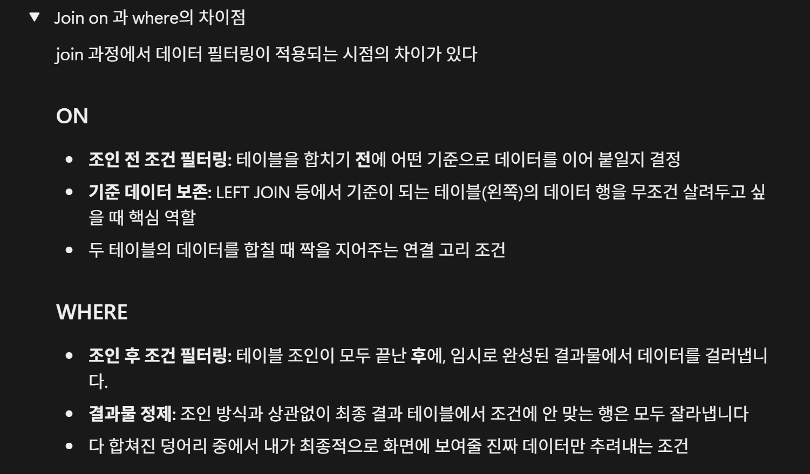

- 피어리뷰(Spring 1팀 빈)
### 워크북 캡쳐

### 워크북 리뷰

<aside>
🌟

on과 where의 차이가 단지 조건이라고 생각했는데, 실제 사용할 때 어떤 식으로 하는 지 쉬운 말로 풀어서 이해하기 좋았다.

</aside>

- **미션 기록**

### 1번 리뷰 작성하는 쿼리

  쿼리문 
  
    필요한 데이터 분류:
        - 평점, 내용, 생성일자를 사용자가 남긴 리뷰 DB에 넣어준다.
    - INSERT INTO review(score, text, user_id, store_id, created_at, updated_at)
      VALUES(5, '음 맛있다', 1, 1, NOW(), NOW());
    - 설명: INSERT 쿼리를 사용해서 이름, 평점, 생성일자, 내용, 사진 등을 DB에 삽입한다.
### 2번 마이 페이지 화면 쿼리

    - 필요한 데이터 분류:
      사용자 테이블에서 이름, 메일, 번호, 포인트 가 필요하다.
    - SELECT name, email, phone_number, user_point
      FROM user
      WHERE id = 1
    설명: 내가 설계했던 DB에는 메일과 번호 데이터가 없어서 ERD에 새로운 컬럼을 생성했다.

### 3번 내가 진행중, 진행 완료한 미션 모아서 보는 쿼리
(페이징 포함)

  쿼리문

    - 필요한 데이터 분류:
        - 사용자 미션 테이블과 미션 테이블을 조인해서 사용
        - 수행상태
    - 쿼리문:
      SELECT m.mission_point AS reward_point,
      um.status AS mission_status,
      s.name AS store_name,
      m.content AS mission_content,
      um.id AS cursor_id
      FROM user_mission um
      JOIN mission m ON m.id = um.mission_id
      JOIN store s ON s.id = m.store_id
      WHERE user_id = 1
      AND um.status = 'success'
      AND um.deleted_at IS NULL
      AND um.id < 25
      ORDER BY um.id desc
      LIMIT 10
    - 설명: 사용자 미션 테이블에서 미션 테이블을 조인하고, 미션 테이블에서
            미션 테이블과 가게 테이블을 조인하여 사용했다.
            id를 커서를 두고 커서 기반 페이징을 사용했다. 
            실제로는 25 자리에 프론트가 보내준 마지막 커서가 들어간다.
 
            

### 4번 홈 화면 쿼리
  (현재 선택 된 지역에서 도전이 가능한 미션 목록, 페이징 포함)

  쿼리문

    - 필요한 데이터 분류:
        - 상단: 주소와 사용자 포인트
        - 프로그레스 바: 미션 완료 횟수
        - 하단 리스트: 사용자 미션 테이블
    - 쿼리문
        - 상단: 
          SELECT address, user_point
          FROM user
          WHERE id = 1 AND deleted_at = IS NULL;

        - 프로그레스 바: 
          SELECT COUNT(id) AS mission_completion
          FROM user_mission
          WHERE user_id = 1
          AND status = “success”
          AND deleted_at IS NULL;

        - 하단: SELECT s.name AS store_name,
          s.category AS store_category,
          DATEDIFF(m.mission_time, CURRENT_DATE()) AS d_day,
          m.content AS missoin_content,
          m.mission_point AS reward_point
          FROM mission m
          JOIN store s ON m.store_id = s.id  
          JOIN region r ON s.region_id = r.id  
          WHERE r.name = '안암동'
            AND m.id NOT IN(
                SELECT mission_id
                FROM user_mission
                WHERE user_id = 1
            )
          ORDER BY m.mission_time ASC  
          LIMIT 10 OFFSET 10

    -설명: 상단에는 사용자 테이블에서 주소와 사용자 포인트를 조회한다.
          프로그레스 바에서 사용자 미션에서 수행상태가 완료인 사용자 미션 개수를 센다.  
          지역 테이블과 가게 테이블을 조인하여 지역 필터링을 진행한다.
          미션을 가져올 때 이미 사용자 미션에 있는 미션들은 가져오지 않는 서브쿼리를 작성한다.