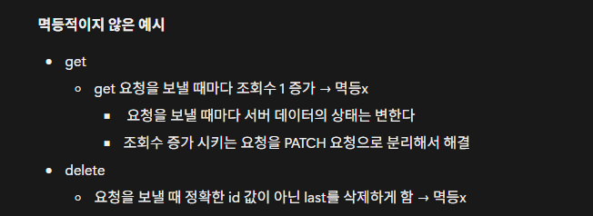

- 피어리뷰(Spring A팀 빈)
### 워크북 캡쳐



### 워크북 리뷰

<aside>
🌟

보통 멱등적인 예시만 생각하는데 멱등적이지 않게 작성된 코드를 가져와서 개선하는 예시가 있어서 이해가 쉬웠다.

</aside>


- 홈 화면
    - **API Endpoint**

        <aside>

      GET/api/home

        </aside>

    - **Request Body**
        - GET은 주로 Request Body를 사용하지 않는다.
    - **Request Header**
        - Authorization: Bearer {Access_Token}
    - **Query Parameter**

        <aside>

      ?regionName=안암동

        </aside>

    - **Path Variable**
        - 없음
    - **Response Body**

        ```json
        {
          "isSuccess": true,
          "code": "COMMON200",
          "message": "성공입니다.",
          "result": {
            "missionList": [
              {
                "missionId": 1,
                "storeName": "반이학생마라탕",
                "category": "중식당",
                "dDay": 7,
                "missionContent": "10,000원 이상의 식사시",
                "missionPoint": 500
              }
            ],
            "nextCursor": 12,
            "hasNext": true
          }
        }
        ```

- 마이 페이지 리뷰 작성
    - **API Endpoint**

        <aside>

      POST/api/stores/{storeId}/reviews

        </aside>

    - **Request Body**

        ```json
        {
        		"score": "4.5",
        		"text": "너무 맛있어요!"
        }
        
        ```

    - **Request Header**
        - Content-Type: application/json
        - Authorization: Bearer {Access_Token}
    - **Query Parameter**
        - 없음
    - **Path Variable**

        ```json
        {
        		"storeId": 3
        }
        ```

    - Response Body

        ```json
        {
          "isSuccess": true,
          "code": "COMMON201",
          "message": "리뷰가 성공적으로 작성되었습니다.",
          "result": {
            "reviewId": 12,
            "createdAt": "2026-03-23T22:30:00"
          }
        }
        ```

- 미션 목록 조회(진행중, 진행 완료)
    - **API Endpoint**

        <aside>

      GET/api/userMissions

        </aside>

    - **Request Body**
        - 없음
    - **Request Header**
        - Authorization: Bearer {Access_Token}
    - **Query Parameter**

        <aside>

      ?status=SUCCESS

        </aside>

    - **Path Variable**
        - 없음
    - Response Body

        ```json
        {
          "isSuccess": true,
          "code": "COMMON200",
          "message": "성공입니다.",
          "result": {
            "myMissionList": [
              {
                "userMissionId": 15,
                "storeName": "가게이름a",
                "missionContent": "12,000원 이상의 식사를 하세요!",
                "missionPoint": 500,
                "status": "SUCCESS"
              }
            ],
            "nextCursor": 12,
            "hasNext": true
          }
        }
        ```

- 미션 성공 누르기 ⇒ 상태가 변화한다.
    - **API Endpoint**

        <aside>

      PATCH/api/mission/{userMissionId}

        </aside>

    - **Request Body**
        - 데이터를 전달하지 않고 DB 내부 변경
    - **Request Header**
        - Authorization: Bearer {Access_Token}
    - **Query Parameter**
        - 없음
    - **Path Variable**

        ```json
        {
        		"userMissionId" : 1
        }
        ```

    - **Response Body**

        ```json
        {
          "isSuccess": true,
          "code": "COMMON200",
          "message": "미션 완료 처리에 성공했습니다.",
          "result": {
            "userMissionId": 15,
            "status": "COMPLETED"
          }
        }
        ```

- 회원 가입하기
    - **API Endpoint**

        <aside>

      POST/auth/users

        </aside>

    - **Request Body**

        ```json
        {
        		"name": "미키",
        		"gender": "남",
        		"address": "인천광역시 미추홀구 xxx",
        		"birth": "2003-04-01",
        		"mail": "xxx@inha.edu",
        		"phoneNumber": "010-xxxx-xxxx"
        }
        ```

    - **Request Header**
        - Content-Type: application/json
    - **Query Parameter**
        - 없음
    - **Path Variable**
        - 없음
    - Response Body

        ```json
        {
          "isSuccess": true,
          "code": "200",
          "message": "회원가입에 성공했습니다.",
          "result": {
            "userId": 1,
            "createdAt": "2026-03-23T22:25:00"
          }
        }
        ```
      
