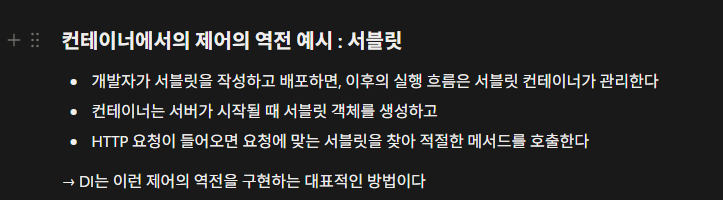

- 피어리뷰(스프링 A팀 빈)

IoC 개념을 서블릿에 대입하여 이해한 것이 인상적이였습니다. IoC의 예시를 서블릿으로 잘 풀어낸 거 같아서 깊이 있는 이해가 되었다고 생각합니다.

- **미션 기록**

  Spring 내장 Tomcat 역할:
  서블릿 컨테이너 ⇒ 서블릿을 지원하는 WAS

  ⇒ WAS 개념 사용 가능

    1. 클라이언트 요청 (GET) → 내장 Tomcat 수신 (모든 요청을 Tomcat에서 처리)
    2. 스레드 할당 / HttpServletRequest / Response 객체 생성
        1. 동시 요청 100개 → 100개 스레드 병렬 처리
        2. 서블릿 객체 생성(매 요청마다)
            1. HttpServletRequest: 요청 데이터(헤더, 바디, 파라미터)
            2. HttpServletResponse: 응답 데이터(JSON, 상태코드)
    3. DispatcherServlet (중앙 컨트롤러 - 싱글톤 ⇒ URL + 메서드 분석 → 컨트롤러 매칭)
        1. @GetMapping 같은 어노테이션과 매칭
        2. 서비스 로직 실행
    4. DB조회
    5. JSON 직렬화 → HttpServletResponse
    6. Tomcat → HTTP 응답 전송